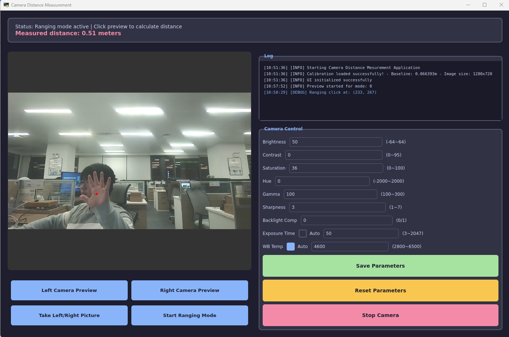

# Camera Distance Measurement

English| [中文](README_zh.md)

This project is a stereo camera distance measurement application implemented on Quectel Pi H1 single-board computer. Click on objects in the camera preview to calculate the real-world distance between the camera and the objects.



## Features
- Distance calculation based on stereo matching principle
   - Click anywhere on the screen to measure distance
   - Uses SGBM stereo matching algorithm
   - Supports calibration parameter optimization for improved accuracy
- Individual left/right camera preview support
- Simultaneous capture of left and right camera images for comparison
- Camera parameter adjustment support for optimized matching results
   - Brightness, contrast, saturation adjustment
   - Exposure time/auto exposure
   - White balance/auto white balance
   - Gamma, sharpness, backlight compensation

---

## Environment Setup

### System Requirements
- **Operating System**: Linux (using V4L2 interface)
- **Python Version**: 3.8+
- **OpenCV Version**: 4.8+
- **PySide6 Version**: 6.5+
- **NumPy Version**: 1.24+

### Dependency Installation

```bash
pip install -r requirements.txt
```

Or install manually:

```bash
pip install PySide6>=6.5.0
pip install opencv-python>=4.8.0
pip install numpy>=1.24.0
```

### System Dependencies (Linux)
```bash
# V4L2 tools (for camera parameter reading)
sudo apt-get install v4l-utils
```

---

## Project Code Structure

```

├── requirements.txt             # Python dependencies list
├── README.md                    # Project documentation (Chinese)
├── README_en.md                 # Project documentation (English)
│
├── src/                         # Distance measurement application source code
|   ├── main.py                  # Main entry point, starts the application 
│   ├── camera_manager.py        # Camera manager class, handles video capture, preview, and photography
│   ├── ranging_calculator.py    # Distance calculator, computes distance based on disparity
│   ├── ui_manager.py            # UI manager, PySide6 GUI implementation
│   ├── common.py                # Common configuration, global state management, auto camera detection
│   └── log_manager.py           # Log manager class
│
├── tools/                       # Calibration tools directory
│   ├── capture_calib_images.py  # Calibration image capture tool
│   ├── generate_calib_params.py # Calibration parameter generation tool
│   ├── stereo_calib_params.npz  # Calibration parameter file (generated after calibration)
│   └── calibration_images/      # Calibration image storage directory (auto-created at runtime)
│       ├── left/                # Left camera calibration images
│       └── right/               # Right camera calibration images
│
└── assets/                      # Assets directory
    ├── test1.png                # Distance measurement demo image
    └── pattern.png              # Chessboard pattern for calibration
```

### Module Description

| File | Function |
|------|----------|
| `main.py` | Application entry point, initializes Qt application and displays main window |
| `src/camera_manager.py` | `CameraManager` class: camera preview thread, parameter settings, stereo photography |
| `src/ranging_calculator.py` | `RangingCalculator` class: load calibration parameters, compute disparity map, calculate distance |
| `src/ui_manager.py` | `UIManager` class: main interface, preview page, photo page, measurement page, settings page |
| `src/common.py` | Global configuration (resolution, device path), `GlobalState` singleton state management |
| `src/log_manager.py` | `LogManager` class: log collection and display |
| `tools/capture_calib_images.py` | Calibration image capture: photograph chessboard image pairs and save |
| `tools/generate_calib_params.py` | Calibration parameter generation: read image pairs, compute stereo calibration parameters |

---

## Hardware Requirements

### Stereo Camera (Specifications are not mandatory; below are the specifications used in this project)
- **Interface Type**: USB
- **Resolution Requirements**:
  - Recommended resolution: 2560×720 (1280×720 for each left/right)
  - Supports other stereo cameras with aspect ratio ≥ 1.8
- **Frame Rate**: Support for 15fps and above
- **Output Format**: YUYV/MJPG

### Calibration Tools (Recommended to print or can use phone display, but avoid glare)
- **Chessboard Calibration Board**: 9×6 inner corners
- **Square Edge Length**: Approximately 9mm (can be displayed on phone screen, specific length adjusts based on actual conditions)
- **Calibration Images**: At least 10 pairs of images from different angles required

### Runtime Environment
- **Development Board/PC**: USB camera support
- **Memory**: Recommended 2GB and above
- **GPU**: Not required (pure CPU computation)

---

## Usage Workflow

### Complete Distance Measurement Workflow

```
┌─────────────────────────────────────────────────────────────
│            Distance Measurement Application Workflow         
├─────────────────────────────────────────────────────────────
│  Step 1: Calibration Image Capture                          
│  ├── Run tools/capture_calib_images.py                     
│  ├── Capture at least 15 pairs of chessboard images        
│  └── Images saved to tools/calibration_images/            
│                                                             
│  Step 2: Calibration Parameter Generation                  
│  ├── Run tools/generate_calib_params.py                    
│  ├── Automatically read calibration images and compute     
│  └── Generate tools/stereo_calib_params.npz               
│                                                              
│  Step 3: Run Distance Measurement Application              
|  ├──  cd src                                                 
│  ├── Run python3 main.py                                    
│  ├── Click "Start Ranging Mode" to enter measurement mode  
│  └── Click target position in preview to get distance      
└─────────────────────────────────────────────────────────────
```

### Step 1: Calibration Image Capture

**Command:**
```bash
python3 tools/capture_calib_images.py
```

**Operating Steps:**
1. After startup, the program displays left and right camera preview images
2. Place the chessboard calibration board in front of the camera at different positions and angles
3. Press `s` key to save the current image pair (recommended to capture 15-20 pairs)
4. Press `q` key to exit the capture program

**Notes:**
- Ensure the chessboard is completely visible in both left and right views
- Try to cover different angles, distances, and positions
- Avoid motion blur and glare

### Step 2: Calibration Parameter Generation

**Command:**
```bash
python3 tools/generate_calib_params.py
```

**Automatic Program Execution:**
1. Read image pairs from `tools/calibration_images/` directory
2. Detect chessboard corners
3. Execute monocular and stereo calibration
4. Calculate reprojection error
5. Generate `tools/stereo_calib_params.npz` calibration parameter file

**Output Information:**
- Left/right camera reprojection error (ideal value <1)
- Stereo reprojection error
- Baseline distance
- Intrinsic and extrinsic matrices

### Step 3: Run Distance Measurement Application

**Command:**
```bash
cd src
python3 main.py
```

**Button Function Description:**
| Button | Function |
|--------|----------|
| Left Camera Preview | Preview left camera alone |
| Right Camera Preview | Preview right camera alone |
| Take Left/Right Picture | Stereo photography (saved to /tmp/) |
| Start Ranging Mode | Enter distance measurement mode |

**Distance Measurement Operation:**
1. Click **"Start Ranging Mode"** to enter measurement mode
2. Click the target position in the preview image
3. Wait for the distance calculation result to display in the top status bar

**Distance Measurement Result Display:**


---

## Calibration Parameter Configuration

To modify calibration parameters, edit the configuration in `tools/capture_calib_images.py` and `tools/generate_calib_params.py`:

```python
# Number of chessboard inner corners (columns × rows)
CHESSBOARD_SIZE = (9, 6)

# Chessboard square edge length (meters), set based on actual physical length of each square during measurement
SQUARE_SIZE = 0.009  # 9mm

```

---

## Technical Principles

### Stereo Distance Measurement Principle
```
Distance Z = (f × B) / d

Where:
- f: Focal length (pixels)
- B: Baseline distance (meters)
- d: Disparity (pixels)
```

### Algorithm Workflow
1. Capture left and right images
2. Stereo rectification (based on calibration parameters)
3. SGBM disparity calculation
4. Disparity to 3D coordinate conversion
5. Extract target point distance

---
